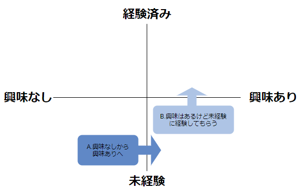

<!-- 懇親会で急遽決まった企画ですが、あたらめて企画書を用意します。 -->

# [企画書]ノンプロ研定例会Vol.51について

作成日　2021年09月26日

作成者　つじけ

## チャンネルなど
- [[Slack]定例会ch](https://nonproken.slack.com/archives/C01HWKH359A)
- [[Slack]ペアプロ広場](https://nonproken.slack.com/archives/CTS681A6L)
- [[Facebook]イベントページ](https://www.facebook.com/events/275138757609560?acontext=%7B%22event_action_history%22%3A[%7B%22surface%22%3A%22group%22%7D]%7D)

## タイトル案
『あなたのスキルが爆上がりする『ペアプロ』の世界（仮）』

## 概要（Facebookページより）
- やりたいツールが自分にはちょっとハードルが高い…
- どうやってコード書けばいいのか悩んでる
- 先輩方のプログラミングの技を盗みたい…！

そんなふうに思っていらっしゃる方に朗報…！

ノンプロ研には、あなたのスキルをバク上げする名物企画「ペアプロ」があります。

今回は、ノンプロ研のペアプロの母、つじけ先生にペアプロとは何か、またその魅力と威力について存分に語っていただきます。

■開催概要
- 日程: 10/21(木)
- スケジュール:
  - 19:45~ オープン
  - 20:00~ オープニング
  - 20:15~ プレゼン by つじけさん
  - 21:45~ お知らせコーナー
  - 22:00~ 懇親会（希望者のみ）

## ターゲットとその背景・前提、ベネフィット
### 【ターゲット】
ターゲットは、ノンプロ研メンバーの中で、**まだ一度もペアプロをやったことがないメンバー**です。

メンバーは、ペアプロに「興味あり」と、「興味なし」で属性が分かれます。

現段階では、**それぞれに訴求できるよう**に企画します。※ターゲットについて後ほど詳しく分析します。

### 【背景・登壇のきっかけ】
ノンプロ研ペアプロは、優良なコンテンツであるにも関わらず、いまいち活用されていません。

「優良なコンテンツ」と思っているのは、主に、主宰やペアプロ経験者です。

とある日の懇親会で「なぜペアプロがいいのか」や、「そもそもペアプロとはなにか」を、ノンプロ研メンバーに伝える機会を設けよう、となりました。

わたしが登壇者に選ばれたのは、**ペアプロ部の創設者**であるからですが、懇親会で**熱量が高かった**のだと思います。

その熱量はどこからくるのかと言えば、わたし自身が**完全な初心者からノンプロ研に入会した**というのがあります。

昨今、ドドドっと新規入会者が増えました。わたしは初心者の気持ちがわかるので、わたし自身のエピソードを話せばよいのです。

### ベネフィット
定例会に参加したあとのメンバーは、「ペアプロ」とはなにをやるのかを理解します。

そして、実際に自分だったら、なにからはじめればいいのか、具体的なイメージが湧きます。

講演が長くなって、要点がまとまらない可能性も出てきます。

メンバーが帰宅するさいに、「今日定例会で聞いたことは、これこれこういうことだったよ」とまとめられる工夫をしたいと思います。

## 扱うテーマ（暫定）
この定例会で扱うテーマは以下です。それぞれ、ターゲットの前提知識（順不動）を整理しておきます。

おもいついたものを並べていますが、ターゲットを精査していくうちに、増減や、ステータスを切り替えたりします。

### ペアプロ
- 要件定義　→　知ってる
- ショートカットキー・辞書ツール　→　知ってる
- ミニマムデータ・テスト　→　知らない
- リファクタリング　→　知らない
- ドライバーとナビゲーター　→　知らない
- モブプロ　→　知らない
- エクストリームプログラミング　→　知らない

### 参加のハードルとなっているもの
- 環境設定　→　知らない
- スキルレベル　→　知らない
- コロナ過のコミュニケーション　→　知らない
- 自己肯定感　→　知らない
- 心理的安全性　→　知らない

### ノンプロ研ペアプロ広場
- Slack　→　知ってる
- Zoom　→　知ってる
- チャンネルの存在　→　知らない
- 過去のペアプロ　→　知らない
- オススメ過去動画　→　知らない
- マッチング方法　→　知らない
- 個人情報の取り扱い　→　知ってる
- ペアプロ当日の流れ　→　知らない
- 卒業制作　→　知ってる

## ターゲット補足
ターゲットを分析して、定例会後の期待する変化を、マトリクスにしてみました。

- A.興味なし未経験　→　興味ありへ
- B.興味あり未経験　→　経験済みへ

ともに、別のアプローチをとる、というわけではありません。以下のようにフェーズは変わります。

1. 興味なし（ペアプロを知らなかった）を興味ありへ移行させる
2. 興味はあるけど経験するにはハードルがある、のハードルを取り除く
3. 経験する

なので、**どのような構成がいいか**は、素材をグループ化した後にでも精査します。

## スケジュール
- 9月27日～　概要まとめ・アウトライン作成・素材集め
- 10月4日～　素材整理グループ化・たたき台スライド
- 10月11日～　本番スライド・完パケ
- 10月18日～ 最終調整・ゲネプロ・ブログ化
- 10月21日　本番

## アウトライン（目次案）

## はじめに（20：00～20:15）
### 定例会の流れ
### 自己紹介
### アイスブレイク
### アジェンダ

## １．ペアプロとはなにか（20：15～20：30）11／15分予定（4分余り）
### プロのペアプロとは　6分
#### プロの開発工程　2分
#### アジャイル開発　2分
#### アジャイル開発のメリット・効果　2分
### ノンプロ研的ペアプロとは　4分
#### リモート・ペア・プログラミング　2分
#### レベル差のありなし　2分
### 1章まとめ　1分

## ２．ノンプロ研ペアプロ部（20：30～20：45）15／15分
### 独学時代のわたし　2分
#### 自己紹介1（学生～社会人）　30秒
#### 自己紹介2（社長のITスキル）　30秒
#### etauさんにITの相談　30秒
#### 2019年7月ノンプロ研入会　30秒
### 社内勉強会スタート　4分
#### 社内勉強会講師　1分
#### チーム書きにチャレンジ　1分
#### なぜわたしがチーム書きをはじめたか　1分
#### etauさんにチーム書きの相談　1分
#### なぜわたしがペアプロに飛び込めたか　1分
### ノンプロ研ペアプロ部誕生　4分
#### 最初の企画　2分
#### 伝播する部活　1分
#### 母の役割　1分
### オンライン化したノンプロ研と弊社　3分
#### コロナ過とリモートワーク　1分
#### 講座・定例会・懇親会のオンライン化　1分
#### 弊社のリモートワーク　1分
### 2章まとめ　1分

## ３．ペアプロ広場（20：45～21：15）25／30分（5分余り）
### ペアプロ広場の紹介　4分
#### Slackチャンネル　2分
#### ノンプロ研Notion　2分
### 開催までの流れ　9分
#### 基本的な考え方　1分
#### 講座からのスピンオフ　1分
#### 困ったことの相談から　1分
#### 上手なマッチング方法　1分
#### 調整さんを使ってみよう　1分
#### イベントページを立ち上げよう　2分
#### 個人情報とデータの扱い方　2分
### ペアプロ当日の流れ　6分
#### ホストの有無　1分
#### アイスブレイク　1分
#### 参加者の心得　1分
#### インターバル制度　1分
#### プレーヤーの心得　1分
#### 感想戦　1分
### オススメアーカイブ動画と企画　6分
#### アーカイブ動画　3分
#### 講座に組み込もう　2分
#### オリジナル企画ＯＫ　1分
### 3章まとめ　2分

## 4．ペアプロの母より（21：15～21：30）16／15分（1分オーバー）
### ノンプログラマーがペアプロをやるメリット・効果　4分
#### 自己関与力　1分
#### ググれないワード　1分
#### イベントドリブン　1分
#### コミュニティへの貢献　1分
### 子たちは語る（ペアプロ経験者の声）　6分
#### 1人目　2分
#### 2人目　2分
#### 3人目　2分
### 心理的安全性　4分
#### 心理的安全性とは　2分
#### ペアプロに参加するコツ　2分
### 4章まとめ　2分

## 質疑応答
### Slido

## お知らせコーナー
以上

## プレゼンするときの注意

### スライドの数をプレゼンの時間から考える

> 短い時間の発表ならば，一枚のスライドは30秒から１分間．少し時間がある発表の場合ならば，一枚，2分間から，どれほど長くても４分間程度までにしておきます.
ということなので、1枚3分程度に。（タカハシさんの定例会を見ると、長くても4分／枚でした。）
- 1章　15分　5枚
- 2章　15分　5枚
- 3章　30分　10枚
- 4章　15分　5枚

### プレゼンテーションにおける資料はシンプルに
- 1スライドあたり70文字以内
- 1スライド・1メッセージ

